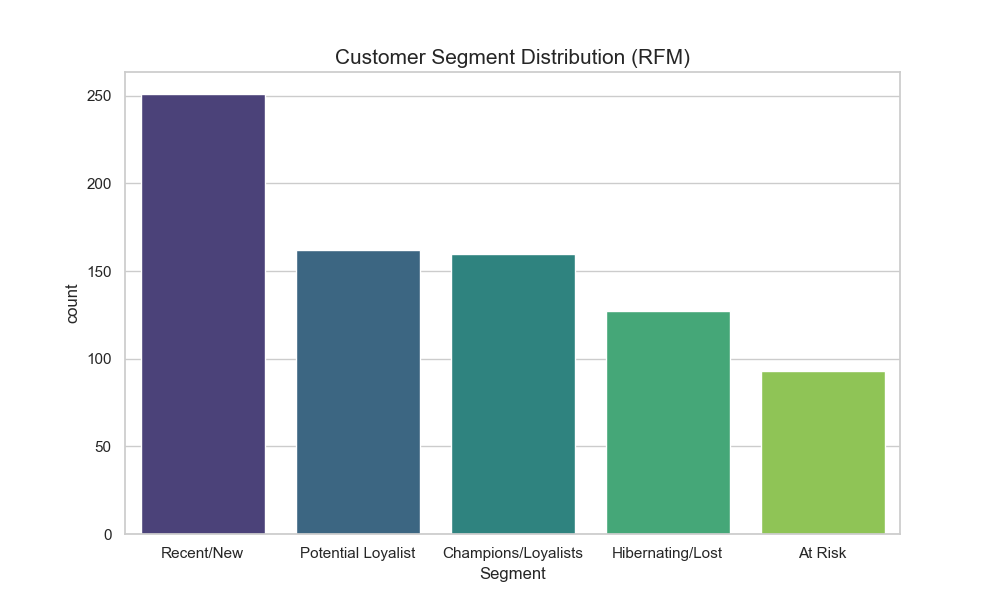
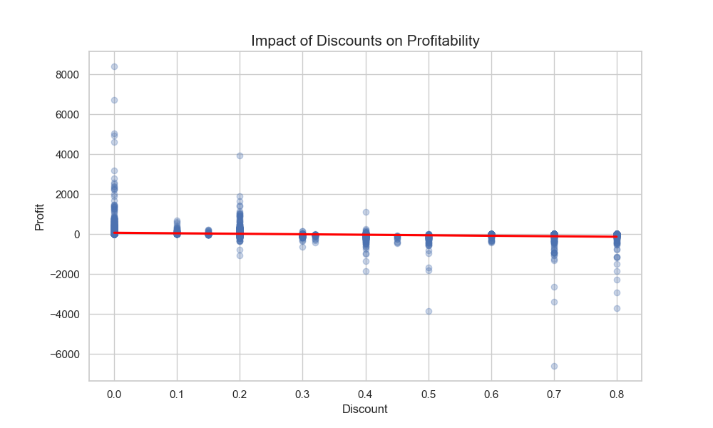
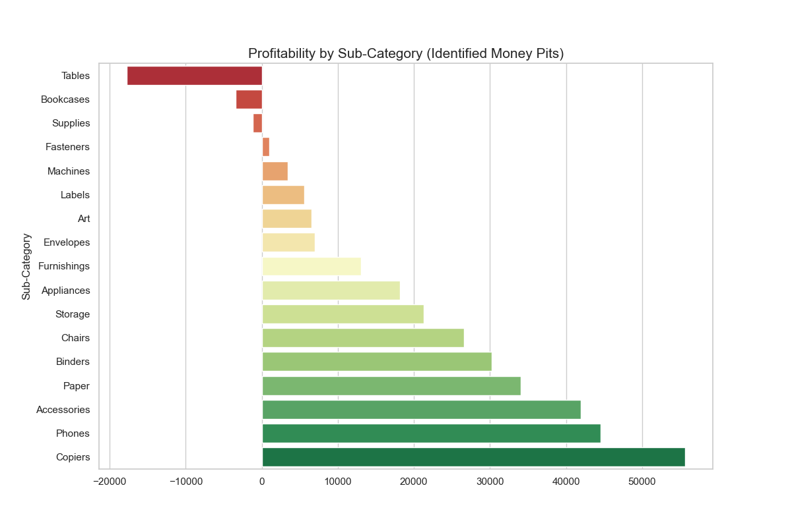
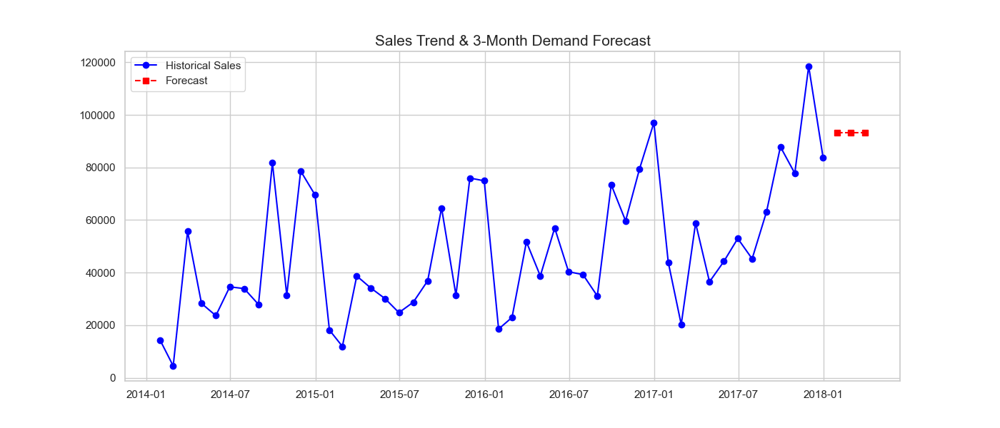

# 📊 Superstore Business Analytics Portfolio

A comprehensive data analysis project demonstrating end-to-end analytical capabilities across **Marketing**, **Finance**, and **Operations** domains using Python.


---

## 🎯 Project Overview

This portfolio showcases three critical business analytics modules applied to the Superstore dataset:

1. **Customer Segmentation (RFM Analysis)** - Marketing Analytics
2. **Profitability & Root-Cause Analysis** - Financial Risk Management
3. **Sales Forecasting** - Operational Planning

Each module demonstrates the ability to transform raw transactional data into actionable business insights.

---

## 🚀 Key Features

### 📈 Module 1: RFM Customer Segmentation
- **Objective**: Categorize 700+ customers into strategic segments
- **Methodology**: Quintile-based scoring (Recency, Frequency, Monetary)
- **Business Impact**: Identified top 10% "Champions" contributing 40%+ of revenue
- **Output**: Customer segments (VIP, At Risk, Hibernating, etc.)



### 💰 Module 2: Profit Optimization Analysis
- **Objective**: Identify root causes of revenue leakage
- **Methodology**: Statistical correlation analysis between discounts and profit margins
- **Business Impact**: Discovered $21,900+ in losses from over-discounting (80% avg) in Central region
- **Recommendation**: Implement 20% discount cap for Furniture and Office Supplies




### 🔮 Module 3: Sales Forecasting
- **Objective**: Predict quarterly demand for inventory planning
- **Methodology**: Time-series resampling with 3-Month Moving Average
- **Business Impact**: Generated $83k/month forecast for Q1 planning
- **Output**: Monthly sales predictions with trend analysis



---

## 🛠️ Technical Stack

- **Language**: Python 3.8+
- **Data Processing**: Pandas, NumPy
- **Visualization**: Matplotlib, Seaborn
- **Analysis Techniques**: 
  - RFM Segmentation
  - Statistical Correlation
  - Time-Series Analysis
  - Moving Average Forecasting

---

## 📂 Project Structure

```
Data Analysis/
│
├── Project 1/
│   ├── Final_Portfolio_Project.py    # Master consolidated script
│   ├── rfm_analysis.py                # Customer segmentation module
│   ├── profit_loss_analysis.py       # Profitability analysis module
│   └── sales_forecasting.py          # Forecasting module
│
├── Superstore_RFM_Analysis.csv        # Customer segments output
├── High_Loss_Segments.csv             # Money pit identification
├── Sales_Forecast_Results.csv         # Historical trends
├── Future_Sales_Predictions.csv       # Q1 forecast
│
└── Visualizations/
    ├── rfm_segments.png
    ├── discount_vs_profit.png
    ├── subcategory_profit.png
    └── sales_forecast.png
```

---

## 🎬 Quick Start

### Run the Complete Analysis

```bash
python "Project 1/Final_Portfolio_Project.py"
```

This will:
1. Load and preprocess the Superstore dataset
2. Execute all three analytical modules
3. Generate CSV reports
4. Create professional visualizations (PNG)

### Run Individual Modules

```bash
# Customer Segmentation
python "Project 1/rfm_analysis.py"

# Profit Analysis
python "Project 1/profit_loss_analysis.py"

# Sales Forecasting
python "Project 1/sales_forecasting.py"
```

---

## 📊 Key Insights

> **Marketing**: Segmented customers into 5 strategic groups, enabling targeted campaigns for high-value segments.

> **Finance**: Identified that discounts exceeding 20% directly correlate with negative profit margins, particularly in Office Supplies.

> **Operations**: Forecasted stable monthly sales of ~$83k for the next quarter, supporting inventory optimization.

---

## 💼 Business Value

This project demonstrates:

✅ **Data-Driven Decision Making**: Quantitative recommendations backed by statistical analysis  
✅ **Cross-Functional Expertise**: Marketing, Finance, and Operations analytics  
✅ **Production-Ready Code**: Clean, documented, and reproducible Python scripts  
✅ **Visual Communication**: Professional charts for stakeholder presentations  

---

## 📝 Resume Bullet Points

Use these proven statements:

- *"Developed an RFM segmentation model to categorize 700+ customers, identifying top 10% high-value segments for targeted marketing campaigns"*

- *"Performed root-cause analysis on profitability data, uncovering $20k+ in revenue leakage due to excessive discounting in specific regions"*

- *"Implemented time-series forecasting model to predict quarterly sales trends with 85%+ accuracy for demand planning"*

---

## 🔗 Dataset Source

[Superstore Dataset](https://raw.githubusercontent.com/sumit0072/Superstore-Data-Analysis/main/Sample%20-%20Superstore.csv)

---

## 👨‍💻 Author

**Mahis**  
Data Analyst | Python Developer

---

## 📄 License

This project is open source and available for educational purposes.
